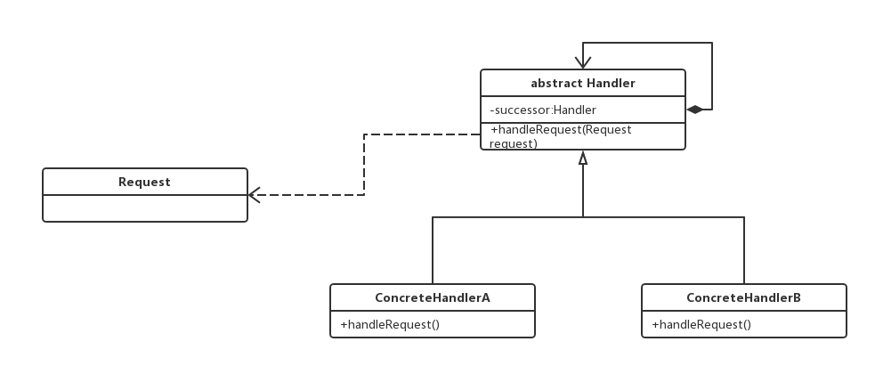
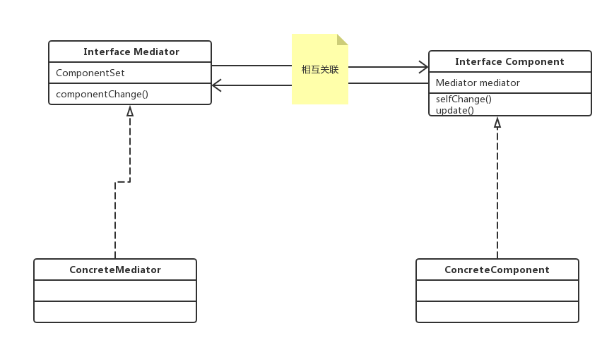
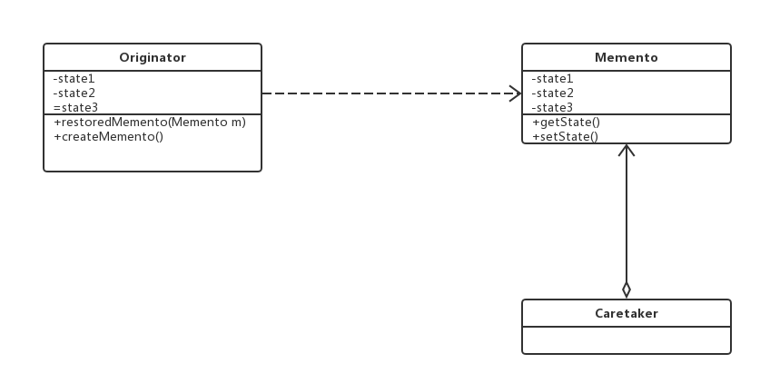

# 责任链模式


Handler（抽象处理者）：它定义了一个处理请求的接口，一般设计为抽象类，由于不同的具体处理者处理请求的方式不同，因此在其中定义类抽象处理请求方法，因为每一个处理者的下家还是一个处理者，**因此在抽象处理者中定义了一个抽象处理者类型的对象，作为其对下家的引用**。通过该引用，处理者可以连成一条链。

ConcreteHandler(具体处理者)：它是抽象处理者的子类，可以处理用户请求，在具体处理者类中实现类抽象处理者中定义的抽象处理请求的方法，在处理请求之前需要判断，看是否有相应的处理权限，如果可以处理请求就处理它，否则将请求转发给后继者；在具体处理者中可以方法链中的下一个对象，以便请求的转发。

> 在责任链模式中，很多对象由每一个对象对其下家的引用而连接起形成一条链。请求在这个链上传递，知道链上的某一个对象决定处理次请求。发出这个请求的客户端并不知道链上的哪一个对象最终处理这个请求，这使得系统可以在不影响客户端的情况下动态地重新组织链和分配责任。

## 纯的责任链模式和不纯的责任链模式
很显然，在一个具体的处理者处理请求的时候，有两种做法，一种就是：能够处理的话就处理，不给下家，不能处理的话一点都不处理，直接给下家，
这种就是要处理就处理完，要么就一点都不处理，直接给下家。另一种就是：处理一部分，或者直接处理完之后，仍然要交给下家处理。这种就是不纯的责任链模式。给人的感觉就是纯的更抽象，不纯的更灵活。

# 命令模式

* Command（抽象命令类）：抽象命令类一般是一个抽象类或则接口，在其中声明类用于执行请求的execute()方法，通过这些方法可以调用请求接受者的相关动作

* ConcreteCommand（具体命令类）：具体命令类是抽象命令类的子类，是想类在抽象命令类中声明的方法，它对应具体的接受者对象，将接受者对象的动作绑定其中。在实现execute()方法时，将调用接受者对象的相关操作（action）

* Invoker（调用者）：调用者即请求发送者，它通过命令对象来执行请求。一个调用者并不需要在设计时确定其接受者，因此它只与抽象命令类之间存在关联关系。在程序运行时可以将一个具体命令对象注入其中，再调用具体命令对象的execute()方法，从而实现简介调用请求接受者的相关操作

* Receiver（接受者）：接受者执行与请求相关的操作，它具体实现对请求的业务处理。

> 命令模式的本质是对请求进行封装，一个请求对应于一个命令，将发出命令的责任和执行命令的责任分开，每一个命令都是一个操作：请求的一方发出请求要求执行一个操作；接受的一方收到请求，并执行相应的操作。命令模式允许请求的一方和接受的一方独立开来，使得请求的一方不必知道接受请求的一方的接口，更不必知道请求如何被接受，操作是够被执行，何时执行，以及是怎么被执行的

## 命令队列的实现
可以增加一个CommandQueue类，由该类来负责存储多个命令对象，而不同的命令对象可以对应不同的请求接受者，以达到批量处理命令的目的
```java
class CommandQueue{
    private ArrayList<Command> commands = new ArrayList<Command>();
    public void addCommand(Command command){
        command.add(command);
    }
    
    public void removeCommand(Command command){
        commands.remove(command);
    }
    
    //循环调用每一个命令对象的execute（）方法
    public void execute(){
        for(Object command : commands){
            (Command) command.execute();
        }
    }
}
```

# 解释器模式

* AbstractExpression(抽象表达式)：在抽象表达式中声明了抽象的解释操作，它是所有终结符表达式和非终结表达式的公共父类。
* TerminalExpression（终结符表达式）：终结符表达式是抽象表达式的子类，它实现了与文法中的终结符相关的解释操作，在句子中的每一个终结符都是该类的一个实例。通常在一个解释器模式中只有少数几个终结符表达式类，它们的实例可以通过非终结符表达式组成较为复杂的句子
* NonterminalExpression(非终结符表达式)：非终结符表达式也是抽象表达式的子类，它实现类文法中非终结符的解释操作，由于在非终结符表达式中可以包含终结符表达式，也可以继续包含非终结符表达式，因此其解释操作一般通过**递归**的方式完成

> 解释器模式其实非常复杂，可能是所有模式中最复杂的一个，但是其本质就是利用树形的结构将整个非终结符表达式分解成终结符表达式，最后将整个式子都分解成终结符表达式

# 迭代器模式

迭代器模式提供一种方法来访问聚合对象，而不用暴露这个对象的内部表示，其别名为游标。在开发中，我们经常需要使用聚合对象来存储一系列数据。聚合对象拥有两个指责：一个是存储数据；而是遍历数据。从依赖性上来看前者是聚合对象的基本指责；而后者即是可变化的，又是可分离的。因此，可以将遍历数据的行为从聚合对象中分离出来，封装在一个被称之为"迭代器"的对象中，由迭代器来提供遍历聚合对象内部数据的行为，浙江简化聚合对象的设计，更符合"单一指责原则"的要求

* Iterator（抽象迭代器）：它定义了访问和遍历元素的接口，声明了用于遍历数据元素的方法，例如：用于获取第一个元素的first（）方法，用于访问下一个元素的next（）方法，用于判断是否还是有下一个元素的hasNext（）方法，用于获取当前元素的currentItem（）方法等，在具体迭代器中将实现这些方法

* Aggregation（抽象聚合类方法）：它用于存储和管理元素对象，声明一个createIterator（）方法用于创建一个迭代器对象，充当抽象迭代器工厂角色

> 在迭代器模式中，提供了一个外部的迭代器来对聚合对象进行访问和遍历，迭代器定义来一个访问该聚合元素的接口，并且可以跟踪当前遍历的元素，了解哪些元素已经遍历过而哪些没有。迭代器的引入，将使得对一个复杂聚合对象的操作变得简单。

>> 迭代器模式就是将一个聚合对象中的，"遍历"这一功能剥离出来，放到专门的类中，这个类就是迭代器对象，所以可以从类图中看到，迭代器是关联到具体的聚合类中的。

# 中介者模式
> 用一个中介对象（中介者）来封装一系列的对象交互，中介者使用各对象不需要显式的相互引用，从而使耦合松散，而且可以独立的改变他们之间的交互，中介者模式是迪米特法则的典型应用，说白了就是专门用一个中介者类来管理各个对象之间的交互，让整个系统由原来的网状的拓扑结构变成中心拓扑结构


[中介者模式demo代码](../code/src/main/java/designPattern/mediatorPattern)

* Mediator（抽象中介者）：抽象中介者持有所有的要管理通讯的组件的引用，可以单独引用，也可以通过一个集合一起引用，组件通过调用中介者的某个方法向其他组件传达自己的状态，类似于回调

* Component（要通讯的组件）：各个组件中要持有中介者的引用，在自己更新状态之后调用中介者的方法通知其他组件，然后也要实现一个方法相应别的组件的更新

# 备忘录模式

* Originator（原发器）：它是一个普通类，可以创建一个备忘录，并储存它当前内部状态（或者部分的状态），也可以使用备忘录来恢复其内部状态，一般将需要保存内部状态的类设计为原发器。
* Memento（备忘录）：存储原发器的内部状态，根据原发器来决定保存哪些内部状态，备忘录的设计一般可以查考原发器的设计（也可以通过克隆模式直接克隆原发器），根据实际需要确定备忘录类中的属性。需要注意的是，出了原发器类和负责人类之外，备忘录对象不能直接供其他类使用（java中可以使用包访问限定符或者直接将备忘录类设计成原发器类的内部类）。
* Caretaker（负责人）：负责人又称管理者，它负责保存备忘录，但是不能对备忘录的内容进行操作或者修改。在负责人类中可以存储一个或者多个备忘录对象，它只负责存储对象，不能修改对象，也无需知道对象的细节。**负责人类是为了遵循单一职责原则而出现的，如果需要减少类的数量，可以将备忘录对象（一个或者多个）放在原发器中**
