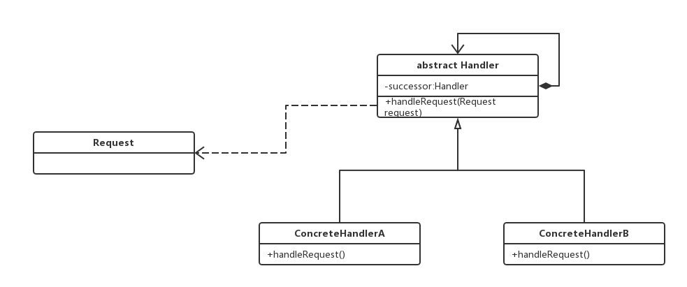
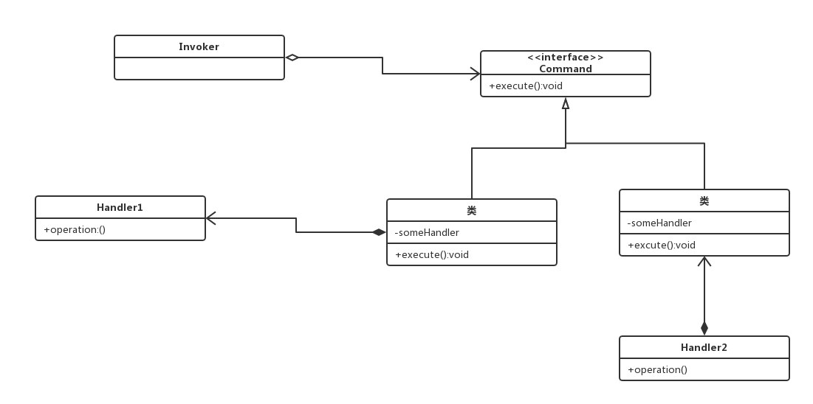

# 责任链模式

Handler（抽象处理者）：它定义了一个处理请求的接口，一般设计为抽象类，由于不同的具体处理者处理请求的方式不同，因此在其中定义类抽象处理请求方法，因为每一个处理者的下家还是一个处理者，**因此在抽象处理者中定义了一个抽象处理者类型的对象，作为其对下家的引用**。通过该引用，处理者可以连成一条链。

ConcreteHandler(具体处理者)：它是抽象处理者的子类，可以处理用户请求，在具体处理者类中实现类抽象处理者中定义的抽象处理请求的方法，在处理请求之前需要判断，看是否有相应的处理权限，如果可以处理请求就处理它，否则将请求转发给后继者；在具体处理者中可以方法链中的下一个对象，以便请求的转发。

> 在责任链模式中，很多对象由每一个对象对其下家的引用而连接起形成一条链。请求在这个链上传递，知道链上的某一个对象决定处理次请求。发出这个请求的客户端并不知道链上的哪一个对象最终处理这个请求，这使得系统可以在不影响客户端的情况下动态地重新组织链和分配责任。

## 纯的责任链模式和不纯的责任链模式
很显然，在一个具体的处理者处理请求的时候，有两种做法，一种就是：能够处理的话就处理，不给下家，不能处理的话一点都不处理，直接给下家，
这种就是要处理就处理完，要么就一点都不处理，直接给下家。另一种就是：处理一部分，或者直接处理完之后，仍然要交给下家处理。这种就是不纯的责任链模式。给人的感觉就是纯的更抽象，不纯的更灵活。

# 命令模式

